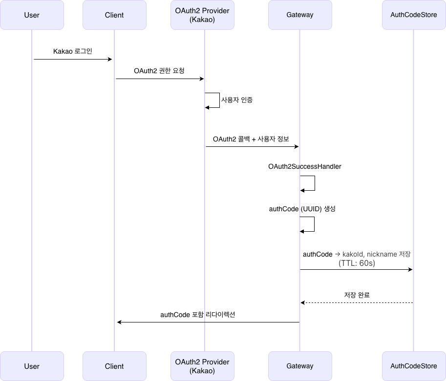
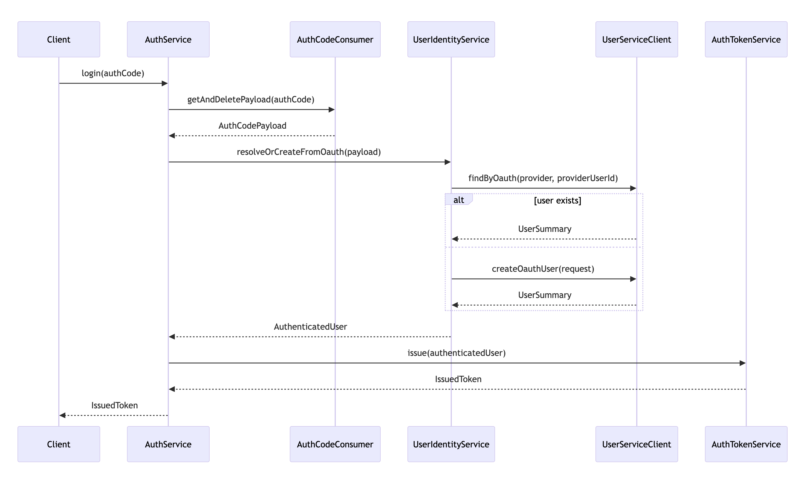
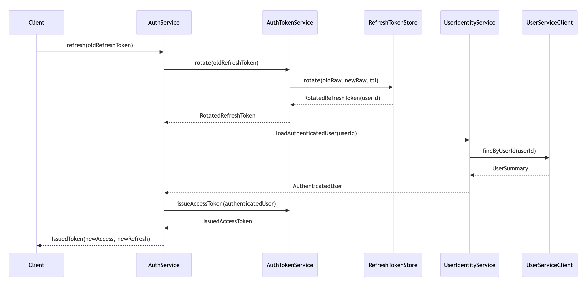

# TodayBook Gateway

본 프로젝트는 **Spring Cloud Gateway(WebFlux)** 기반의 **API Gateway와 인증(Auth) 도메인**을 구현한 시스템이다.  
Gateway는 외부 요청의 단일 진입점을 담당하며, Auth 도메인은 **OAuth2 기반 로그인과 토큰 발급·관리**를 책임진다.

본 시스템은 **세션리스 인증 구조**를 채택하여 수평 확장이 가능하도록 설계되었으며,  
외부 OAuth2 Provider는 사용자 식별에만 사용하고 **내부 서비스는 자체 발급 토큰만 신뢰**한다.

로그인 과정에서는 OAuth2 토큰을 직접 노출하지 않고 **일회성 authCode(UUID)** 를 발급·소비하여  
토큰 탈취 및 재사용 위험을 최소화한다.

Refresh Token은 **Redis와 Lua Script 기반 Rotation 전략**으로 관리되어,  
동시 요청 환경에서도 토큰 재사용과 레이스 컨디션을 방지한다.

현재는 Gateway 내부에 Auth 기능을 포함하고 있으나,  
책임 경계를 명확히 유지하여 **향후 Auth 도메인을 독립 서비스로 분리할 수 있도록 설계**되었다.

---

## 1. Architecture at a Glance

본 섹션은 시스템을 구성하는 주요 컴포넌트와 인증 흐름을 한눈에 이해할 수 있도록 전체 구조를 요약한다.

### 주요 구성 요소

- **Client**
    - 브라우저 또는 모바일 앱
    - OAuth2 로그인 요청, authCode 기반 로그인, 토큰 재발급 요청을 수행한다.

- **API Gateway (Spring Cloud Gateway)**
    - 외부 요청의 단일 진입점(Entry Point)
    - OAuth2 로그인 진입, 인증 API(`/auth/**`) 처리
    - Rate Limiting, 공통 보안 정책 적용

- **Auth Domain**
    - OAuth2 로그인 성공 처리
    - 일회성 authCode 발급 및 소비
    - Access Token / Refresh Token 발급 및 재발급
    - Refresh Token Rotation 처리

- **OAuth2 Provider (Kakao)**
    - 사용자 신원 확인만 담당
    - OAuth2 Access Token은 내부 시스템으로 전파되지 않는다.

- **Redis**
    - authCode 임시 저장 (TTL 기반, 1회성)
    - Refresh Token 상태 관리
    - Lua Script를 통한 원자적 Token Rotation 수행

### 인증 흐름 요약

1. Client는 OAuth2 Provider(Kakao)를 통해 로그인을 수행한다.
2. OAuth2 로그인 성공 시, Gateway/Auth 도메인은 **일회성 authCode**를 발급하여 Client로 전달한다.
3. Client는 authCode를 사용해 `/auth/v1/login` API를 호출한다.
4. Auth 도메인은 authCode를 **단 1회 소비**하여 사용자 식별 후 토큰을 발급한다.
5. Access Token은 응답으로 전달되고, Refresh Token은 **HttpOnly Cookie**로 관리된다.
6. 토큰 재발급 시 Refresh Token은 Redis + Lua Script 기반 **Rotation 전략**으로 교체된다.

본 구조는 인증 로직을 Gateway 중심으로 통합하면서도,  
Auth 도메인을 독립적으로 분리할 수 있는 확장성을 고려한 아키텍처이다.

---

## 2. Gateway vs Auth Responsibilities

인증 로직을 Gateway에 과도하게 집중시키면 보안 정책과 도메인 로직이 결합되어 변경 비용이 증가한다.  
본 시스템은 이러한 문제를 피하기 위해 Gateway와 Auth 도메인의 책임을 명확히 분리하였다.

### Gateway Responsibilities

- 외부 요청의 **단일 진입점(Entry Point)** 역할 수행
- OAuth2 로그인 진입 및 인증 API(`/auth/**`) 라우팅
- Rate Limiting, CORS 등 **공통 보안·운영 정책 적용**
- 인증된 요청만 내부 로직으로 전달

### Auth Responsibilities

- OAuth2 로그인 성공 처리 및 **일회성 authCode 발급**
- authCode 단 1회 소비를 통한 로그인 처리
- **Access / Refresh Token 발급 및 재발급**
- Redis + Lua Script 기반 **Refresh Token Rotation**
- 로그아웃 처리 및 토큰 무효화(best-effort)

이러한 책임 분리를 통해 Gateway는 **트래픽 제어와 보안 관문 역할**에 집중하고,  
Auth 도메인은 **인증 및 토큰 관리라는 핵심 도메인 로직**에만 집중할 수 있도록 하였다.

현재는 단일 애플리케이션으로 구성되어 있으나,  
책임 경계가 명확히 정의되어 있어 **Auth 도메인을 독립 서비스로 분리하는 확장도 용이**하다.

---

## 3. Authentication Flow

본 섹션에서는 OAuth2 로그인부터 토큰 재발급까지의 전체 인증 흐름을 단계별로 설명한다.  
각 흐름은 **보안 경계 명확화, 일회성 처리, 레이스 컨디션 방지**를 목표로 설계되었다.

### 3.1 OAuth2 Login Flow (Kakao)

1. Client는 Gateway를 통해 OAuth2 Provider(Kakao)로 로그인 요청을 전달한다.
2. 사용자가 Kakao 로그인을 완료하면, OAuth2 Provider는 Gateway로 인증 성공을 콜백한다.
3. Gateway/Auth 도메인은 OAuth2 사용자 정보를 기반으로 **일회성 authCode(UUID)** 를 생성한다.
4. authCode는 Redis에 **짧은 TTL**로 저장되며, Client는 authCode를 포함한 Redirect URL로 이동한다.

> OAuth2 Access Token은 클라이언트 또는 내부 서비스로 전달되지 않으며,  
> OAuth2 Provider는 사용자 신원 확인 용도로만 사용된다.

### 3.2 authCode Login Flow

1. Client는 전달받은 authCode를 사용해 `/auth/v1/login` API를 호출한다.
2. Auth 도메인은 Redis에서 authCode를 **단 1회 소비(get-and-delete)** 한다.
3. authCode에 매핑된 OAuth2 사용자 정보를 기반으로 사용자를 조회하거나 신규 생성한다.
4. 인증이 완료되면 Access Token과 Refresh Token을 발급한다.
5. Access Token은 응답 바디로 반환되며, Refresh Token은 **HttpOnly Cookie**로 설정된다.

> authCode는 소비 즉시 삭제되므로 재사용이 불가능하며,  
> 이를 통해 인증 코드 탈취 및 재전송 공격을 방지한다.

### 3.3 Refresh Token Rotation Flow

1. Client는 Access Token 만료 시 `/auth/v1/refresh` API를 호출한다.
2. Auth 도메인은 Cookie에 포함된 Refresh Token을 검증한다.
3. Redis + Lua Script를 사용해 다음 과정을 **원자적으로 수행**한다.
    - 기존 Refresh Token 검증
    - 기존 토큰 즉시 무효화
    - 신규 Refresh Token 저장
4. 신규 Access Token과 Refresh Token을 발급하여 응답한다.

> Refresh Token은 항상 **rotate 방식**으로 교체되며,  
> 동시 요청 환경에서도 토큰 재사용 및 레이스 컨디션을 방지한다.

### 3.4 Logout Flow

1. Client는 `/auth/v1/logout` API를 호출한다.
2. Auth 도메인은 Refresh Token을 서버 측에서 무효화(best-effort)한다.
3. Client의 Refresh Token Cookie는 항상 삭제된다.

> 로그아웃 API는 **멱등성(idempotent)** 을 보장하며,  
> Refresh Token 유무와 관계없이 동일한 결과를 반환한다.

---

## 4. Key Design Decisions

본 섹션에서는 인증 시스템 설계 과정에서 내려진 주요 기술적 판단과 그 배경을 설명한다.

### 일회성 authCode 기반 로그인

OAuth2 로그인 이후 토큰을 클라이언트에 직접 전달하지 않고,  
**일회성 authCode(UUID)** 를 발급하여 후속 로그인 API에서 단 1회만 소비하도록 설계하였다.  
이를 통해 OAuth2 토큰 노출을 방지하고, 인증 흐름의 보안 경계를 명확히 할 수 있다.

### 세션리스 인증 구조 채택

HTTP Session을 사용하지 않고 Access Token / Refresh Token 기반 인증 구조를 채택하였다.  
이로 인해 서버 간 세션 동기화가 필요 없으며,  
Gateway와 Auth 도메인은 **수평 확장에 제약이 없는 구조**를 유지할 수 있다.

### Refresh Token Rotation 전략

Refresh Token 재사용을 허용할 경우,  
토큰 탈취나 동시 요청 상황에서 보안 문제가 발생할 수 있다.  
이를 방지하기 위해 Refresh Token은 **항상 rotate 방식**으로 교체되도록 설계하였다.

### Redis + Lua Script기반 원자적 토큰 교체

Refresh Token 회전 과정에서의 레이스 컨디션을 방지하기 위해  
Redis Lua Script를 사용하여 **검증 → 폐기 → 신규 저장**을 하나의 원자적 연산으로 처리하였다.  
이를 통해 동시 요청 환경에서도 토큰 상태의 일관성을 보장한다.

### Gateway 중심의 인증 진입점 통합

모든 외부 요청은 Gateway를 통해 유입되도록 설계하여  
OAuth2 로그인, 인증 API 접근, 보안 정책 적용을 하나의 관문에서 통제한다.  
이를 통해 인증 로직이 각 서비스에 분산되는 것을 방지하고 운영 복잡도를 줄였다.

### Auth 도메인의 독립 가능성 유지

현재는 단일 애플리케이션 구조이나, Gateway와 Auth의 책임을 명확히 분리하여  
향후 Auth 도메인을 독립 서비스로 분리하더라도 아키텍처 변경을 최소화할 수 있도록 설계하였다.

---

## 5. Failure & Edge Cases

본 시스템은 인증 과정에서 발생할 수 있는 다양한 실패 시나리오를 고려하여  
보안성과 일관성을 유지하도록 설계되었다.

### authCode 만료 또는 재사용

authCode는 Redis에 **짧은 TTL**로 저장되며,  
소비 시점에 **단 1회(get-and-delete)** 만 사용 가능하다.

- TTL 만료 또는 이미 소비된 authCode 사용 시 로그인은 실패한다.
- 이를 통해 authCode 탈취, 재전송 공격, 중복 요청을 방지한다.

### Refresh Token 중복 요청 (Race Condition)

Access Token 만료 시,  
클라이언트 환경에 따라 Refresh 요청이 동시에 발생할 수 있다.

- Refresh Token은 **Redis + Lua Script 기반 Rotation 전략**으로 관리된다.
- 기존 토큰 검증, 폐기, 신규 토큰 저장을 **원자적으로 수행**하여  
  동시 요청 환경에서도 토큰 재사용을 방지한다.

### Refresh Token Cookie 누락

Refresh 요청 시 Cookie에 Refresh Token이 존재하지 않는 경우:

- 요청은 즉시 인증 실패로 처리된다.
- 서버 상태 변경 없이 안전하게 종료된다.

### 로그아웃 중복 호출

로그아웃 API는 **멱등성(idempotent)** 을 보장한다.

- Refresh Token 유무와 관계없이 항상 동일한 결과를 반환한다.
- 클라이언트의 중복 호출이나 네트워크 재시도 상황에서도 시스템 상태의 일관성을 유지한다.

### OAuth2 Provider 장애 또는 실패

OAuth2 Provider(Kakao) 로그인 과정에서 오류가 발생할 경우:

- 인증 흐름은 즉시 중단된다.
- 내부 토큰 발급 및 상태 변경은 발생하지 않는다.
- 외부 인증 실패가 내부 인증 상태에 영향을 주지 않도록 설계되었다.

---

## 6. Tech Stack

- Java 21
- Spring Boot / Spring Cloud Gateway (WebFlux)
- Spring Security OAuth2 Client
- Redis (authCode Store, RefreshToken Store)
- Lua Script(Refresh Token Rotation)
- Docker

---

## 7. Extensibility

- 인증 프로토콜 확장 (OAuth2 ↔ OIDC)
- Token 포맷 변경 대응
- 인증 이벤트 발행을 통한 감사·보안 처리 확장
- Gateway 앞단 Edge 보안 계층(CDN, WAF) 확장

---

## 8. Summary

본 프로젝트는 **Spring Cloud Gateway 기반의 인증 중심 API Gateway**로,  
외부 요청의 단일 진입점에서 인증 흐름과 보안 정책을 통합적으로 제어하도록 설계되었다.

Gateway는 트래픽 제어와 보안 관문 역할을 담당하고,  
Auth 도메인은 OAuth2 기반 로그인과 토큰 발급·관리를 책임지도록  
**명확한 책임 분리 구조**를 갖는다.

일회성 authCode 기반 로그인과 **Redis + Lua Script를 활용한 Refresh Token Rotation**을 통해  
보안성과 동시성 문제를 모두 고려한 인증 흐름을 구현하였다.

현재는 단일 애플리케이션 구조이나,  
향후 Auth 도메인 분리 및 인증 요구사항 확장을 고려한  
**유연하고 확장 가능한 Gateway 중심 아키텍처**를 지향한다.
